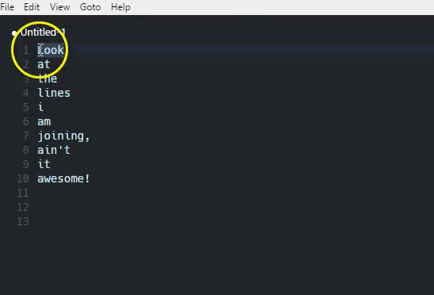

# Join lines for Visual Studio Code

> This extension tries to mimic the join_lines command that you know and love from Sublime Text. It's not perfect yet, but it works pretty much like it.

## Functionality

When I recently started using Visual Studio Code I quickly started missing the join lines command which I had become addicted to in Sublime Text 3.
So I decided to create an extension that implement's that functionality.

**Join lines for Visual Studio Code** employ's the `ctrl+j` shortcut to join the line below your cursor to the one you’re currently editing.
This is handy if you want to join the following line with the current one without having to go through all the whitespace in between, with this extension installed just use `ctrl+j`



## Install

Press F1 in Visual Studio Code, then ext, then select install and type joinlines then hit enter.

## Manual Install

**Mac & Linux**
```sh
cd $HOME/.vscode/extensions
```
**Windows**
```sh
cd %USERPROFILE%\.vscode\extensions
```

**All Platforms**
```
git clone https://github.com/webdokkeren/vscode-join-lines
cd vscode-join-lines
npm install
```

## Configuration
So the ctrl+j doesn't suit you ? No problem, just reassign it to another keybinding by Going to File -> Preferences -> Keyboard shortcuts
You can now override the keybinding typing in the following:  

_keybindings.json_
```json
[
    //... Other keybinding overrides

    { "key": "ctrl+k", "command": "joinLines.joinLines", "when": "editorTextFocus" }
]
```
